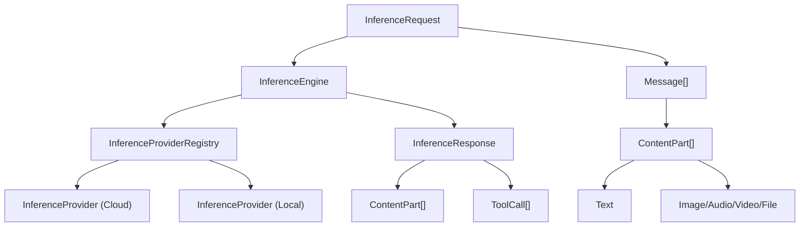
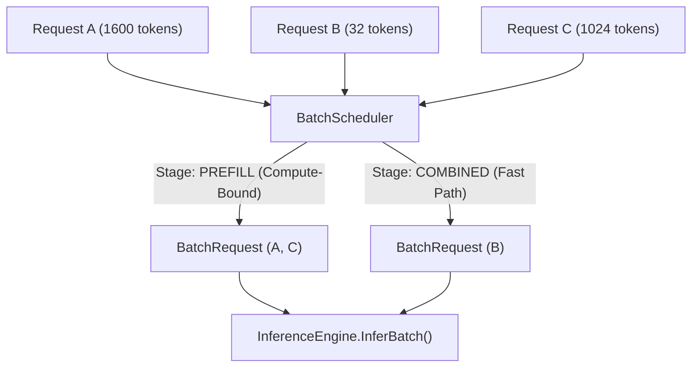

<div align="center">
  
  
  # Gollek Inference Engine
  
  [](https://jdk.java.net/22/)
  [](https://gradle.org/)
  [](https://opensource.org/licenses/MIT)
</div>

This repository hosts the Gollek platform. Gollek is designed to be a high-performance inference engine for AI models, acting as the foundation for the larger Wayang ecosystem.

## Installation

### Prerequisites
- JDK 22 or higher
- Gradle
- macOS (Apple Silicon recommended for Metal acceleration) or Linux with CUDA

### Build and Install
Clone the repository and build the modules using Gradle:

```bash
git clone https://github.com/kayys/wayang-platform.git
cd wayang-platform

# Build all modules and publish to Maven Local
cd alkhawarizm
./gradlew publishToMavenLocal

cd ../gollek
./gradlew publishToMavenLocal
```

*Note: The `autograd` module in Alkhawarizm is currently disabled to prioritize build stability.*

## Usage

You can run the Wayang development script to start a local model for inference. For example, to run the `gemma-4-12b-it-GGUF` model:

```bash
./scripts/run-dev.sh run --model hf:unsloth/gemma-4-12b-it-GGUF --prompt "who are you"
```

This will download the model (if not already cached) and execute the inference using the Gollek GGUF engine with the Alkhawarizm Metal backend on macOS.

## Architecture & Sub-Systems

The core logic revolves around the **Gollek Inference Engine**, which is supported by ecosystem projects that have now graduated into their own standalone repositories:

- **Gollek** (This Repository): The high-performance inference engine. Supports execution of large language models via various runners, including `llama.cpp` for GGUF models. It is designed to safely handle multi-modal inference, large context windows, and advanced generation parameters.
- **Alkhawarizm** (Standalone Project): The core tensor and compute engine. It provides high-performance backends for Safetensor operations, including CPU, CUDA, Metal (Apple Silicon), and HAT. 
- **Tafkir** (Standalone Project): The orchestration, reasoning, and training backend, routing operations to inference engines.
- **Gamelan** (Standalone Project): The workflow engine for designing and executing multi-agent AI workflows and RAG pipelines.
- **Wayang Core**: The foundational shared models, clients, and services that tie the sub-systems together.


## Features

### 🤖 Gollek Inference Engine
- **Local Models**: Advanced GGUF support (via `llama.cpp` JNI bindings), ONNX, LibTorch, TFLite.
- **GPU Acceleration**: Metal (Apple Silicon) with unified memory fallback, CUDA support.
- **Optimization**: Implements KV Cache optimizations, FlashAttention, and handles context parameters efficiently to avoid memory fragmentation.

### 🧠 Alkhawarizm Compute (Tensor) Engine
- **Multi-Backend**: Supports Metal, CUDA, CPU, and HAT.
- **Custom Kernels**: Provides native hardware-optimized operations (e.g. `RMSNorm`, `LayerNorm`, Matrix Multiplications) to maximize LLM evaluation throughput.

### 🎼 Gamelan Workflow Engine
- Orchestrate AI agents and complex tool-use workflows.
- Extensible logic and visual integration.

## Documentation

- Core API contracts are defined within the respective `spi` and `core` packages of each family.
- Explore the sub-directories for specific READMEs and module-level JavaDocs.


## Architecture

### Multimodal Pipeline



### Batching & Disaggregation Scheduler


