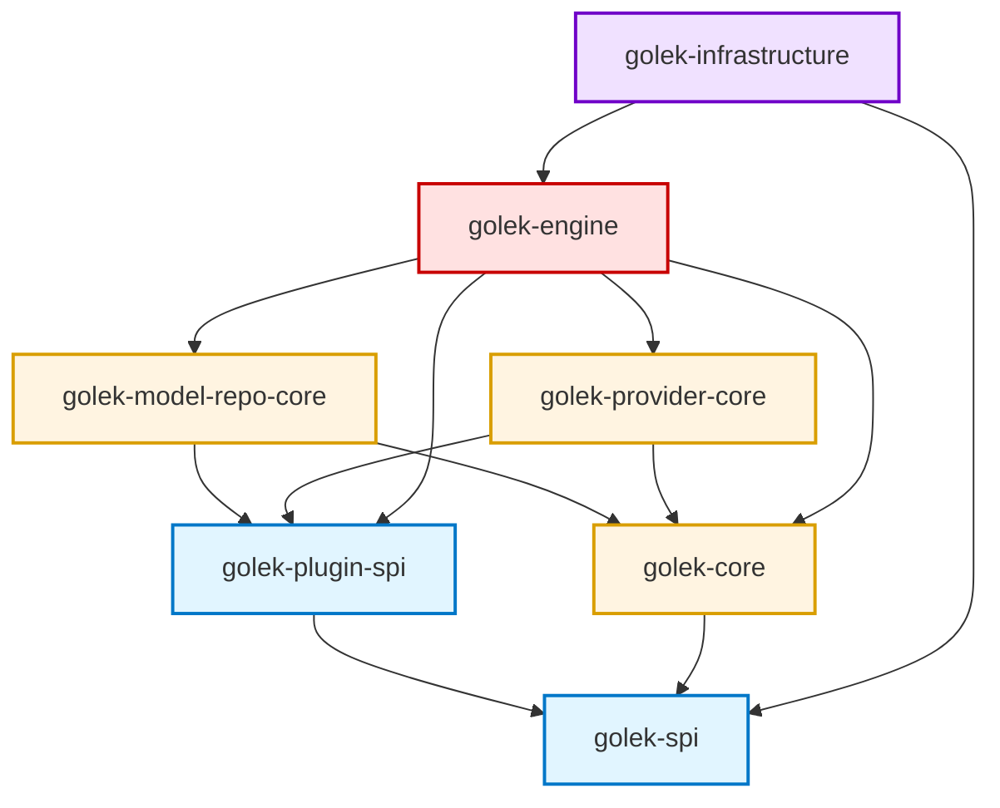

# Golek Core — Module Guide

This directory contains the core building blocks for Golek. Each module has a focused scope and clear dependency direction.

## Module Structure

### **golek-spi** (Interfaces & Contracts)
**Purpose**: Public APIs, interfaces, and value objects that other modules depend on

**Key Principle**: Only interfaces, DTOs, and exceptions. No implementations.

---

### **golek-core** (Core Domain Logic)
**Purpose**: Core business logic, domain models, and base implementations

**Key Principle**: Domain logic, no framework-specific code (Jakarta, Quarkus, etc.)

---

### **golek-model-repo-core** (Model Repository Layer)
**Purpose**: Model discovery, loading, and repository management


**Key Principle**: Focus on model metadata, discovery, and artifact management. No inference execution logic.

---

### **golek-provider-core** (Provider SPI)
**Purpose**: Service Provider Interface for pluggable model runners

**Key Principle**: Clean separation between model repository (metadata) and provider (execution)

---

### **golek-engine** (Inference Engine Implementation)
**Purpose**: Concrete implementations of inference pipeline and orchestration

**Key Principle**: Framework-specific implementations (Jakarta CDI, Quarkus), orchestration logic

---

### **golek-infrastructure** (Infrastructure & Integration)
**Purpose**: Framework integration, REST resources, persistence

**Key Principle**: All infrastructure concerns - HTTP, persistence, monitoring, plugin loading

---

### **golek-plugin-spi** (Plugin Development API)
**Purpose**: API for third-party plugin developers

**Key Principle**: Everything a plugin developer needs, isolated from internal implementation

---

## Capability Map (Quick)

* **API Contracts**: `inference-golek/core/golek-spi/`
* **Domain + Policy**: `inference-golek/core/golek-core/`
* **Engine Orchestration**: `inference-golek/core/golek-engine/`
* **Model Registry & Artifacts**: `inference-golek/core/golek-model-repo-core/`
* **Provider SPI**: `inference-golek/core/golek-provider-core/`
* **Infrastructure**: `inference-golek/core/golek-infrastructure/`
* **Plugin API**: `inference-golek/core/golek-plugin-spi/`

## Error Codes

Generate docs for the centralized error codes:

```bash
./scripts/generate-error-codes.sh
```

## Dependency Flow

The modules should depend on each other in this order (no circular dependencies):



**Legend**:
- **Blue** (golek-spi, golek-plugin-spi): **Contracts & APIs** - Stable interfaces, minimal dependencies
- **Yellow** (golek-core, model-repo, provider-core): **Domain Layer** - Business logic & SPI definitions
- **Red** (golek-engine): **Application Layer** - Orchestration, reliability patterns, implementation
- **Purple** (golek-infrastructure): **Infrastructure Layer** - Framework integration (Quarkus/REST), adapters

---

---

## Best Practices

### 1. **Single Responsibility Principle**
- Each module should have ONE clear purpose
- If you can't describe a module's purpose in one sentence, it's doing too much

### 2. **Acyclic Dependencies**
- Never allow circular dependencies between modules
- Use interfaces in lower-level modules to break cycles

### 3. **Stable Dependencies Principle**
- Depend on modules that change less frequently
- `golek-spi` should be the most stable (rarely changes)
- `golek-infrastructure` can change frequently

### 4. **Interface Segregation**
- Put interfaces in the module that defines the abstraction
- Put implementations in the module that provides the functionality

### 5. **Naming Conventions**
- **Interfaces**: Use descriptive nouns (`ModelRepository`, `InferenceEngine`)
- **Implementations**: Prefix with implementation strategy (`Default`, `Cached`, `Enhanced`)
- **Abstract Classes**: Prefix with `Abstract` (`AbstractPlugin`)
- **DTOs**: Suffix based on purpose (`Request`, `Response`, `Metadata`)

---
