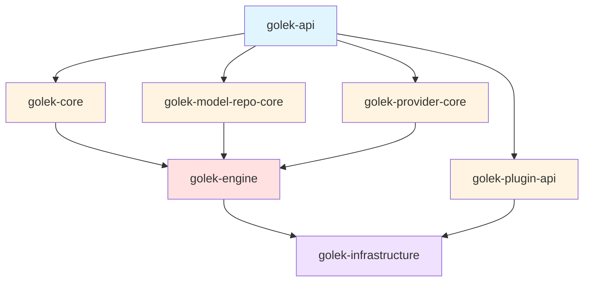

# Module Organization Guide for Golek Core

## Current Issues Identified

Based on the analysis of your core modules, here are the main organizational issues:

### 1. **Code Duplication**
- `ModelRunner` exists in both `golek-model-repo-core` and `golek-engine`
- `ModelRunnerFactory` duplicated across modules
- `HardwareDetector` appears in multiple modules
- `RuntimeMetricsCache` duplicated
- `DefaultPluginLifecycle` exists in both `golek-core` and `golek-engine`
- `GolekPluginRegistry` duplicated

### 2. **Unclear Module Boundaries**
- `golek-engine` contains infrastructure concerns (resources, plugins) mixed with business logic
- Model-related classes scattered across `golek-model-repo-core` and `golek-engine`
- Observability classes split across modules

---

## Recommended Module Structure

### **golek-api** (Interfaces & Contracts)
**Purpose**: Public APIs, interfaces, and value objects that other modules depend on

**Package Structure**:
```
tech.kayys.golek.api/
├── inference/
│   ├── InferenceRequest
│   ├── InferenceResponse
│   ├── InferenceEngine (interface)
│   └── StreamingResponse (interface)
├── model/
│   ├── ModelRef
│   ├── ModelDescriptor
│   ├── ModelManifest
│   ├── ModelRunner (interface)
│   └── ModelRepository (interface)
├── plugin/
│   ├── Plugin (interface)
│   ├── PluginMetadata
│   ├── PluginContext
│   └── ExtensionPoint
├── tenant/
│   └── TenantContext
├── exception/
│   ├── InferenceException
│   ├── ModelLoadException
│   └── AuthorizationException
└── common/
    ├── HealthStatus
    └── Pageable
```

**Key Principle**: Only interfaces, DTOs, and exceptions. No implementations.

---

### **golek-core** (Core Domain Logic)
**Purpose**: Core business logic, domain models, and base implementations

**Package Structure**:
```
tech.kayys.golek.core/
├── inference/
│   ├── InferencePhase (enum)
│   └── InferenceObserver (interface)
├── execution/
│   ├── ExecutionContext (interface)
│   ├── ExecutionToken
│   ├── ExecutionStatus (enum)
│   ├── ExecutionSignal (enum)
│   └── ExecutionStateMachine (interface)
├── plugin/
│   ├── PluginLifecycle (interface)
│   ├── PluginState (enum)
│   ├── PluginConfiguration
│   ├── PluginDependency
│   ├── AbstractPlugin (base class)
│   └── GolekPlugin (annotation)
├── reliability/
│   ├── FallbackStrategy (interface)
│   └── FallbackStrategyRegistry
├── config/
│   └── ConfigurationManager
└── exception/
    ├── IllegalStateTransitionException
    ├── NoCompatibleProviderException
    └── TenantQuotaExceededException
```

**Key Principle**: Domain logic, no framework-specific code (Jakarta, Quarkus, etc.)

---

### **golek-model-repo-core** (Model Repository Layer)
**Purpose**: Model discovery, loading, and repository management

**Package Structure**:
```
tech.kayys.golek.model/
├── core/
│   ├── ModelManifest
│   ├── ModelArtifact
│   ├── ArtifactLocation
│   ├── ModelRunnerProvider (interface)
│   ├── RunnerMetadata
│   ├── RunnerCandidate
│   └── SelectionPolicy
├── repository/
│   ├── ModelRepository (interface)
│   ├── ModelRepositoryProvider (interface)
│   ├── ModelRepositoryRegistry
│   └── CachedModelRepository
├── download/
│   ├── DownloadManager
│   └── DownloadProgressListener
├── hardware/
│   ├── HardwareCapabilities
│   ├── HardwareDetector
│   ├── ResourceRequirements
│   └── SupportedDevice
└── exception/
    ├── ModelNotFoundException
    └── ArtifactDownloadException
```

**Key Principle**: Focus on model metadata, discovery, and artifact management. No inference execution logic.

---

### **golek-provider-core** (Provider SPI)
**Purpose**: Service Provider Interface for pluggable model runners

**Package Structure**:
```
tech.kayys.golek.provider/
├── spi/
│   ├── ModelRunnerProvider (moved from model-repo-core)
│   ├── ModelRunnerFactory
│   └── ProviderMetadata
├── registry/
│   ├── ProviderRegistry
│   └── ProviderCandidate
├── lifecycle/
│   ├── ProviderLifecycle
│   └── ProviderState
└── exception/
    └── ProviderInitializationException
```

**Key Principle**: Clean separation between model repository (metadata) and provider (execution)

---

### **golek-engine** (Inference Engine Implementation)
**Purpose**: Concrete implementations of inference pipeline and orchestration

**Package Structure**:
```
tech.kayys.golek.engine/
├── inference/
│   ├── DefaultInferenceEngine (CDI bean)
│   ├── DefaultInferencePipeline
│   ├── InferenceOrchestrator
│   └── ReliabilityManager
├── execution/
│   ├── DefaultExecutionContext
│   └── DefaultExecutionStateMachine
├── model/
│   ├── ModelRouterService
│   ├── RequestContext
│   ├── RoutingContext
│   └── RoutingDecision
├── context/
│   └── DefaultEngineContext
├── observability/
│   ├── InferenceMetricsCollector
│   ├── MetricsPublisher
│   └── RuntimeMetricsCache
└── bootstrap/
    ├── InferenceEngineBootstrap
    └── InferenceEngineShutdown
```

**Key Principle**: Framework-specific implementations (Jakarta CDI, Quarkus), orchestration logic

---

### **golek-infrastructure** (Infrastructure & Integration)
**Purpose**: Framework integration, REST resources, persistence

**Package Structure**:
```
tech.kayys.golek.infrastructure/
├── rest/
│   ├── InferenceResource
│   └── ProviderManagementResource
├── plugin/
│   ├── DefaultPluginLifecycle (moved from engine)
│   ├── GolekPluginRegistry
│   └── PluginManager
├── persistence/
│   └── TenantConfigRepository
├── observability/
│   ├── LogAggregator
│   ├── MetricsRegistry
│   └── ObservabilityManager
└── module/
    ├── KernelModule
    └── SystemModule
```

**Key Principle**: All infrastructure concerns - HTTP, persistence, monitoring, plugin loading

---

### **golek-plugin-api** (Plugin Development API)
**Purpose**: API for third-party plugin developers

**Package Structure**:
```
tech.kayys.golek.plugin/
├── api/
│   ├── Plugin (interface from golek-api)
│   ├── PluginContext
│   ├── PluginMetadata
│   └── ExtensionPoint
├── phase/
│   ├── InferencePhasePlugin (interface)
│   └── GolekConfigurablePlugin
├── lifecycle/
│   ├── PluginLifecycle
│   ├── PluginState
│   └── PluginListener
└── classloader/
    └── PluginClassLoader
```

**Key Principle**: Everything a plugin developer needs, isolated from internal implementation

---

## Dependency Flow

The modules should depend on each other in this order (no circular dependencies):



**Legend**:
- **Blue** (golek-api): Contracts only
- **Yellow** (golek-core, golek-model-repo-core, golek-provider-core, golek-plugin-api): Domain layer
- **Red** (golek-engine): Application layer
- **Purple** (golek-infrastructure): Infrastructure layer

---

## Refactoring Steps

### Phase 1: Consolidate Duplicates
1. **Remove duplicate classes**:
   - Keep `ModelRunner` interface in `golek-api`
   - Keep `ModelRunnerFactory` in `golek-provider-core`
   - Keep `HardwareDetector` in `golek-model-repo-core`
   - Keep `DefaultPluginLifecycle` in `golek-infrastructure`
   - Keep `GolekPluginRegistry` in `golek-infrastructure`

2. **Update imports** across all modules

### Phase 2: Extract Interfaces to golek-api
1. Move all interfaces from implementation modules to `golek-api`
2. Keep only DTOs and value objects in `golek-api`
3. Ensure `golek-api` has NO dependencies on other golek modules

### Phase 3: Separate Concerns
1. **Move infrastructure out of golek-engine**:
   - REST resources → `golek-infrastructure`
   - Plugin management → `golek-infrastructure`
   - Observability infrastructure → `golek-infrastructure`

2. **Clean up golek-engine**:
   - Keep only inference orchestration
   - Keep only execution logic
   - Remove all `@Path` annotated classes

### Phase 4: Provider SPI Separation
1. Move provider-related classes from `golek-model-repo-core` to `golek-provider-core`
2. Keep model metadata in `golek-model-repo-core`
3. Keep execution contracts in `golek-provider-core`

---

## Best Practices

### 1. **Single Responsibility Principle**
- Each module should have ONE clear purpose
- If you can't describe a module's purpose in one sentence, it's doing too much

### 2. **Acyclic Dependencies**
- Never allow circular dependencies between modules
- Use interfaces in lower-level modules to break cycles

### 3. **Stable Dependencies Principle**
- Depend on modules that change less frequently
- `golek-api` should be the most stable (rarely changes)
- `golek-infrastructure` can change frequently

### 4. **Interface Segregation**
- Put interfaces in the module that defines the abstraction
- Put implementations in the module that provides the functionality

### 5. **Package by Feature, Not by Layer**
Within each module:
```
✅ Good:
tech.kayys.golek.model/
├── core/           (all model core classes)
├── repository/     (all repository classes)
└── download/       (all download classes)

❌ Bad:
tech.kayys.golek.model/
├── interfaces/     (mixing concerns)
├── impl/           (mixing concerns)
└── dto/            (mixing concerns)
```

### 6. **Naming Conventions**
- **Interfaces**: Use descriptive nouns (`ModelRepository`, `InferenceEngine`)
- **Implementations**: Prefix with implementation strategy (`Default`, `Cached`, `Enhanced`)
- **Abstract Classes**: Prefix with `Abstract` (`AbstractPlugin`)
- **DTOs**: Suffix based on purpose (`Request`, `Response`, `Metadata`)

---

## Quick Reference: Where to Put New Classes

| Class Type | Module | Example |
|------------|--------|---------|
| Public API interface | `golek-api` | `InferenceEngine` |
| Domain model | `golek-core` | `ExecutionToken` |
| Model metadata | `golek-model-repo-core` | `ModelManifest` |
| Provider SPI | `golek-provider-core` | `ModelRunnerProvider` |
| Plugin API | `golek-plugin-api` | `InferencePhasePlugin` |
| Inference implementation | `golek-engine` | `DefaultInferenceEngine` |
| REST endpoint | `golek-infrastructure` | `InferenceResource` |
| Database entity | `golek-infrastructure` | `ModelEntity` |

---

## Migration Checklist

- [ ] Document current dependency graph
- [ ] Identify all duplicate classes
- [ ] Create `golek-api` module with clean interfaces
- [ ] Extract infrastructure from `golek-engine` to `golek-infrastructure`
- [ ] Separate provider SPI into `golek-provider-core`
- [ ] Update all Maven POMs with correct dependencies
- [ ] Run full build to verify no circular dependencies
- [ ] Update documentation
- [ ] Create architecture decision record (ADR)
