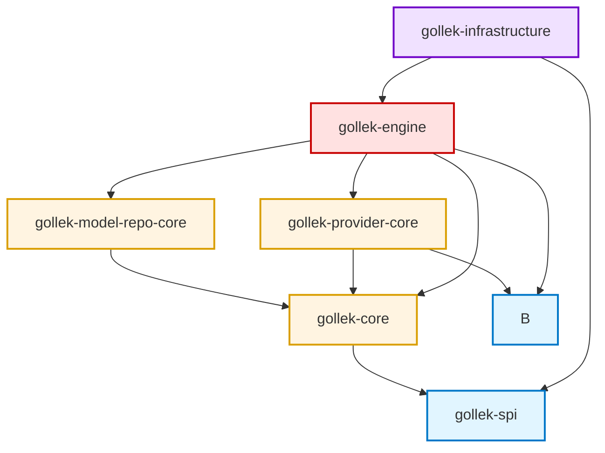
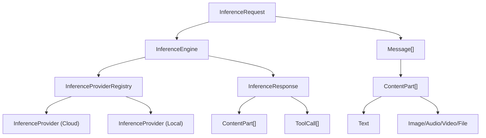
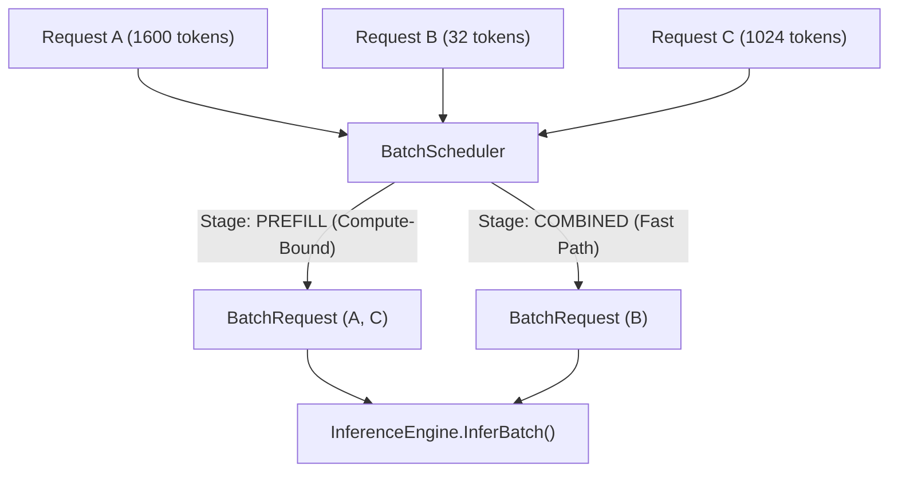

# Gollek Core — Module Guide

This directory contains the core building blocks for Gollek. Each module has a focused scope and clear dependency direction.

## Module Structure

### **gollek-spi** (Interfaces & Contracts)
**Purpose**: Public APIs, interfaces, and value objects that other modules depend on

**Key Principle**: Only interfaces, DTOs, and exceptions. No implementations.

---

### **gollek-core** (Core Domain Logic)
**Purpose**: Core business logic, domain models, and base implementations

**Key Principle**: Domain logic, no framework-specific code (Jakarta, Quarkus, etc.)

---

### **gollek-model-repo-core** (Model Repository Layer)
**Purpose**: Model discovery, loading, and repository management


**Key Principle**: Focus on model metadata, discovery, and artifact management. No inference execution logic.

---

### **gollek-provider-core** (Provider SPI)
**Purpose**: Service Provider Interface for pluggable model runners

**Key Principle**: Clean separation between model repository (metadata) and provider (execution)

---

### **gollek-engine** (Inference Engine Implementation)
**Purpose**: Concrete implementations of inference pipeline and orchestration

**Key Principle**: Framework-specific implementations (Jakarta CDI, Quarkus), orchestration logic

---

### **gollek-infrastructure** (Infrastructure & Integration)
**Purpose**: Framework integration, REST resources, persistence

**Key Principle**: All infrastructure concerns - HTTP, persistence, monitoring, plugin loading

---

## Capability Map (Quick)

* **API Contracts**: `inference-gollek/core/gollek-spi/`
* **Domain + Policy**: `inference-gollek/core/gollek-core/`
* **Engine Orchestration**: `inference-gollek/core/gollek-engine/`
* **Model Registry & Artifacts**: `inference-gollek/core/gollek-model-repo-core/`
* **Provider SPI**: `inference-gollek/core/gollek-provider-core/`
* **Infrastructure**: `inference-gollek/core/gollek-infrastructure/`
* **Plugin API**: `inference-gollek/core/gollek-spi/`

## Error Codes

Generate docs for the centralized error codes:

```bash
./scripts/generate-error-codes.sh
```

## Dependency Flow

The modules should depend on each other in this order (no circular dependencies):



**Legend**:
- **Blue** (gollek-spi): **Contracts & APIs** - Stable interfaces, minimal dependencies
- **Yellow** (gollek-core, model-repo, provider-core): **Domain Layer** - Business logic & SPI definitions
- **Red** (gollek-engine): **Application Layer** - Orchestration, reliability patterns, implementation
- **Purple** (gollek-infrastructure): **Infrastructure Layer** - Framework integration (Quarkus/REST), adapters

---

---

## Best Practices

### 1. **Single Responsibility Principle**
- Each module should have ONE clear purpose
- If you can't describe a module's purpose in one sentence, it's doing too much

### 2. **Acyclic Dependencies**
- Never allow circular dependencies between modules
- Use interfaces in lower-level modules to break cycles

### 3. **Stable Dependencies Principle**
- Depend on modules that change less frequently
- `gollek-spi` should be the most stable (rarely changes)
- `gollek-infrastructure` can change frequently

### 4. **Interface Segregation**
- Put interfaces in the module that defines the abstraction
- Put implementations in the module that provides the functionality

### 5. **Naming Conventions**
- **Interfaces**: Use descriptive nouns (`ModelRepository`, `InferenceEngine`)
- **Implementations**: Prefix with implementation strategy (`Default`, `Cached`, `Enhanced`)
- **Abstract Classes**: Prefix with `Abstract` (`AbstractPlugin`)
- **DTOs**: Suffix based on purpose (`Request`, `Response`, `Metadata`)

---


# Walkthrough: Multimodal/Omni Inference Support for Golek Core

## Summary

Added comprehensive multimodal and omni-model inference support to `pkg/core/` in the golek Go workflow engine. This introduces first-class content types for text, image, audio, video, file, and embedding modalities, plus a provider SPI for inference engine integration.

## Changes Made

### New Files

| File | Purpose |
|------|---------|
| [inference.go](file:///Users/bhangun/Workspace/workkayys/Products/Wayang/golek/pkg/core/inference.go) | Core inference types: `ContentPart`, `Message`, `InferenceRequest`, `InferenceResponse`, `StreamChunk`, `InferenceEngine` interface |
| [provider.go](file:///Users/bhangun/Workspace/workkayys/Products/Wayang/golek/pkg/core/provider.go) | Provider SPI: `InferenceProvider`, `ProviderCapabilities`, `ProviderHealth`, `InferenceProviderRegistry` |
| [inference_test.go](file:///Users/bhangun/Workspace/workkayys/Products/Wayang/golek/pkg/core/inference_test.go) | 21 tests for inference domain types |
| [provider_test.go](file:///Users/bhangun/Workspace/workkayys/Products/Wayang/golek/pkg/core/provider_test.go) | 12 tests for provider SPI types |

### Modified Files

| File | Change |
|------|--------|
| [domain.go](file:///Users/bhangun/Workspace/workkayys/Products/Wayang/golek/pkg/core/domain.go) | Added `NodeTypeInference` and `PluginTypeInference` constants |

## Architecture

## Changes Made

### New Files

| File | Purpose |
|------|---------|
| [inference.go](file:///Users/bhangun/Workspace/workkayys/Products/Wayang/golek/pkg/core/inference.go) | Core inference types: [ContentPart](file:///Users/bhangun/Workspace/workkayys/Products/Wayang/golek/pkg/core/inference.go#71-79), [Message](file:///Users/bhangun/Workspace/workkayys/Products/Wayang/golek/pkg/core/inference.go#192-198), [InferenceRequest](file:///Users/bhangun/Workspace/workkayys/Products/Wayang/golek/pkg/core/inference.go#269-282), [InferenceResponse](file:///Users/bhangun/Workspace/workkayys/Products/Wayang/golek/pkg/core/inference.go#383-394), [StreamChunk](file:///Users/bhangun/Workspace/workkayys/Products/Wayang/golek/pkg/core/inference.go#430-437), [InferenceEngine](file:///Users/bhangun/Workspace/workkayys/Products/Wayang/golek/pkg/core/inference.go#449-465) interface |
| [provider.go](file:///Users/bhangun/Workspace/workkayys/Products/Wayang/golek/pkg/core/provider.go) | Provider SPI: [InferenceProvider](file:///Users/bhangun/Workspace/workkayys/Products/Wayang/golek/pkg/core/provider.go#19-49), [ProviderCapabilities](file:///Users/bhangun/Workspace/workkayys/Products/Wayang/golek/pkg/core/provider.go#58-91), [ProviderHealth](file:///Users/bhangun/Workspace/workkayys/Products/Wayang/golek/pkg/core/provider.go#162-168), [InferenceProviderRegistry](file:///Users/bhangun/Workspace/workkayys/Products/Wayang/golek/pkg/core/provider.go#238-264) |
| [inference_test.go](file:///Users/bhangun/Workspace/workkayys/Products/Wayang/golek/pkg/core/inference_test.go) | 21 tests for inference domain types |
| [provider_test.go](file:///Users/bhangun/Workspace/workkayys/Products/Wayang/golek/pkg/core/provider_test.go) | 12 tests for provider SPI types |
| [batching.go](file:///Users/bhangun/Workspace/workkayys/Products/Wayang/golek/pkg/core/batching.go) | Batching Domain: [BatchStrategy](file:///Users/bhangun/Workspace/workkayys/Products/Wayang/golek/pkg/core/batching.go#18-19), [InferenceStage](file:///Users/bhangun/Workspace/workkayys/Products/Wayang/golek/pkg/core/batching.go#43-44), [BatchConfig](file:///Users/bhangun/Workspace/workkayys/Products/Wayang/golek/pkg/core/batching.go#76-100), [BatchRequest](file:///Users/bhangun/Workspace/workkayys/Products/Wayang/golek/pkg/core/batching.go#149-156), [BatchScheduler](file:///Users/bhangun/Workspace/workkayys/Products/Wayang/golek/pkg/core/batching.go#246-273) |
| [batching_test.go](file:///Users/bhangun/Workspace/workkayys/Products/Wayang/golek/pkg/core/batching_test.go) | 15 tests for batching configurations and stage routing |

### Modified Files

| File | Change |
|------|--------|
| [domain.go](file:///Users/bhangun/Workspace/workkayys/Products/Wayang/golek/pkg/core/domain.go) | Added `NodeTypeInference` and `PluginTypeInference` constants |
| [inference.go](file:///Users/bhangun/Workspace/workkayys/Products/Wayang/golek/pkg/core/inference.go) | Added [Stage](file:///Users/bhangun/Workspace/workkayys/Products/Wayang/golek/pkg/core/batching.go#43-44)/`PromptTokenCount` to [InferenceRequest](file:///Users/bhangun/Workspace/workkayys/Products/Wayang/golek/pkg/core/inference.go#269-282), added [InferBatch()](file:///Users/bhangun/Workspace/workkayys/Products/Wayang/golek/pkg/core/inference.go#453-455) method |
| [provider.go](file:///Users/bhangun/Workspace/workkayys/Products/Wayang/golek/pkg/core/provider.go) | Added [Batching](file:///Users/bhangun/Workspace/workkayys/Products/Wayang/golek/pkg/core/batching_test.go#264-276) flag and `MaxBatchSize` to [ProviderCapabilities](file:///Users/bhangun/Workspace/workkayys/Products/Wayang/golek/pkg/core/provider.go#58-91) |

## Architecture

### Multimodal Pipeline



### Batching & Disaggregation Scheduler




## Architecture

### Multimodal Pipeline


### Batching & Disaggregation Scheduler


