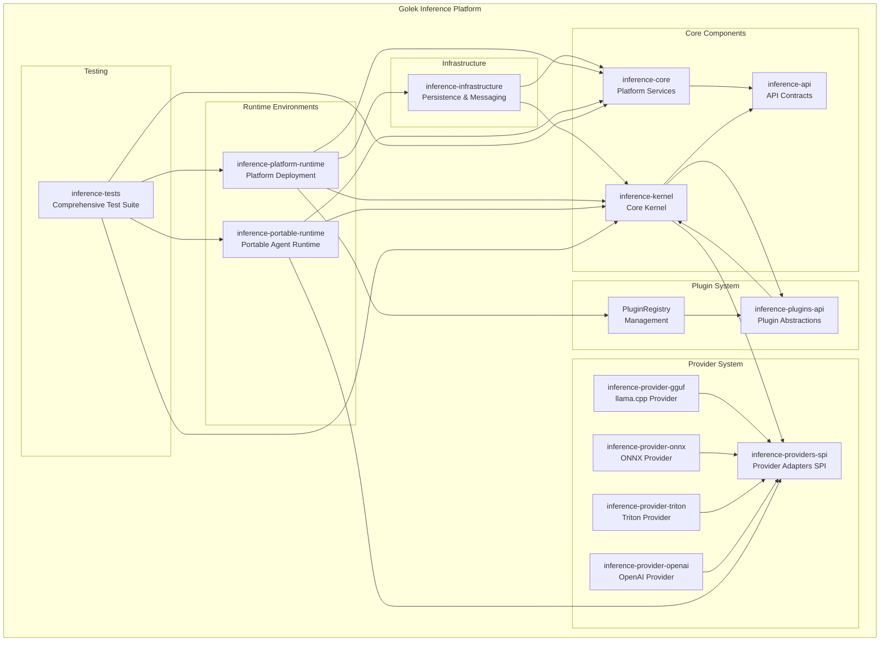
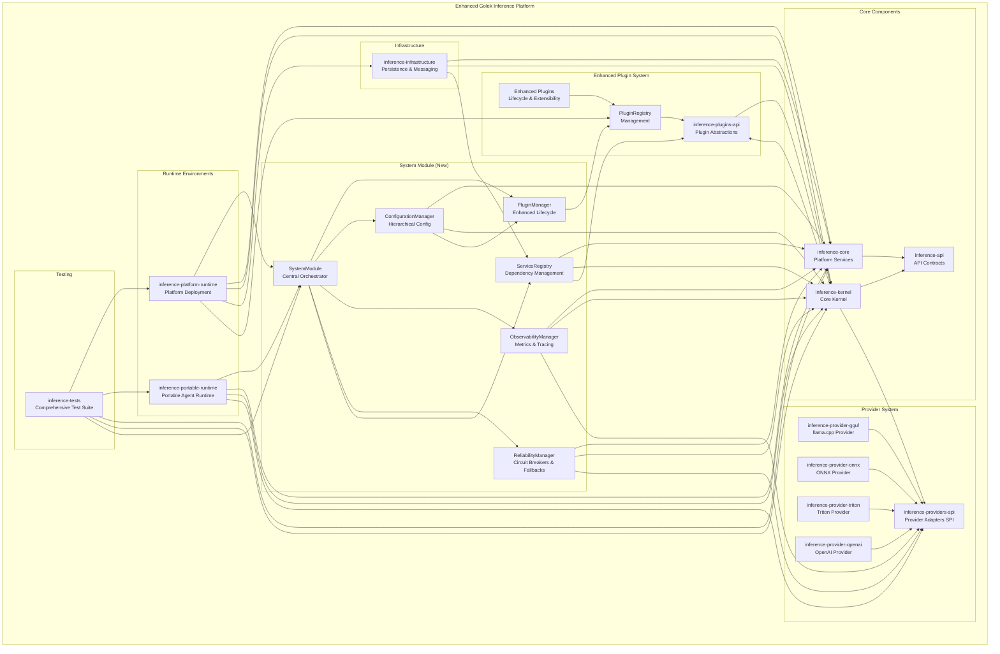

# Golek Inference Platform Architecture

## Current Architecture

## Updated Architecture with Enhancements

## Key Improvements in the Enhanced Architecture

### 1. System Module Layer
- **Central Orchestration**: The `SystemModule` acts as the central orchestrator for all core components
- **Unified Management**: Coordinates plugin lifecycle, configuration, observability, and reliability

### 2. Enhanced Plugin System
- **Advanced Lifecycle Management**: `PluginManager` with proper state transitions and dependency management
- **Extensibility Points**: Clear interfaces for extending functionality
- **Hot-Reload Capability**: Supports dynamic plugin loading/unloading

### 3. Configuration Management
- **Hierarchical Configuration**: Multiple layers with fallback chains
- **Runtime Configuration**: Dynamic updates without restart
- **Type-Safe Access**: Compile-time safety for configuration properties

### 4. Observability & Monitoring
- **Distributed Tracing**: OpenTelemetry integration for request tracing
- **Metrics Collection**: Comprehensive metrics for performance monitoring
- **Structured Logging**: Consistent logging format for analysis

### 5. Reliability & Fault Tolerance
- **Circuit Breakers**: Prevent cascading failures
- **Retry Mechanisms**: Automatic retry with exponential backoff
- **Fallback Strategies**: Graceful degradation patterns
- **Bulkhead Isolation**: Resource isolation between tenants/components

### 6. Service Registry
- **Dependency Injection**: Centralized service registration and lookup
- **Loose Coupling**: Components don't need to know about each other directly
- **Testability**: Easy mocking and testing of components

### 7. Modular Design Principles
- **Clear Separation of Concerns**: Each module has well-defined responsibilities
- **Loose Coupling**: Components interact through well-defined interfaces
- **High Cohesion**: Related functionality grouped together
- **Extensibility**: Easy to add new features through plugins

This enhanced architecture provides a solid foundation for building a future-proof, reliable, and modular inference platform that can easily accommodate growth and new requirements.