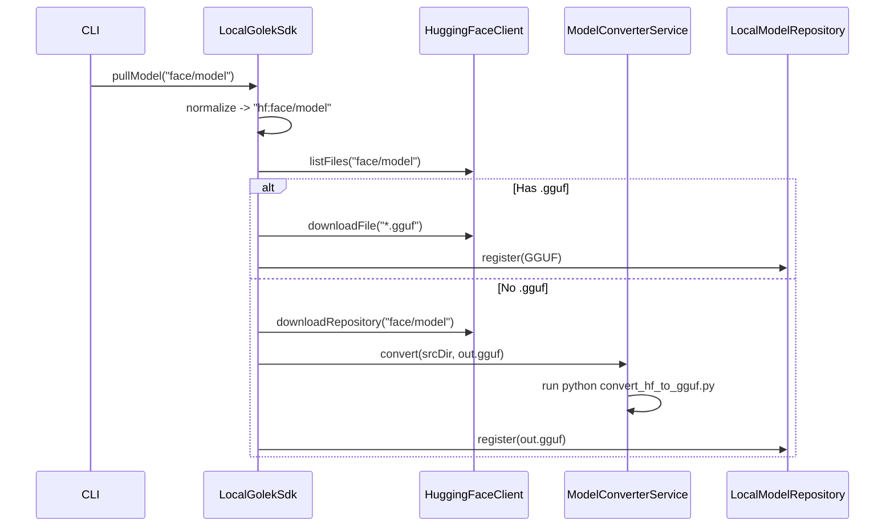

# GGUF Adapter (llama.cpp)

This adapter provides native inference support for GGUF/ggml models via llama.cpp bindings.

## Key Capabilities

* GGUF artifact loading
* CPU/CUDA support
* Token generation via llama.cpp

## Key Paths

* Binding: `inference-golek/adapter/golek-ext-format-gguf/src/main/java/tech/kayys/golek/inference/gguf/LlamaCppBinding.java`
* Runner: `inference-golek/adapter/golek-ext-format-gguf/src/main/java/tech/kayys/golek/inference/gguf/LlamaCppRunner.java`
* Config: `inference-golek/adapter/golek-ext-format-gguf/src/main/java/tech/kayys/golek/inference/gguf/GGUFConfig.java`


**Responsibility**:
- Locate `convert_hf_to_gguf.py` script.
- Execute python script to convert HF model directory to GGUF file.
- Handle process execution and logging.

### 2. LocalGolekSdk
**Location**: `sdk/golek-sdk-java-local/src/main/java/tech/kayys/golek/sdk/local/LocalGolekSdk.java`

**Changes**:
- **Default Provider**: Change default to `gguf`.
- **`pullModel` Logic**:
  - Default prefix `hf:` if none specified.
  - If `hf:`:
    - Check for `*.gguf` files in repo via `HuggingFaceClient`.
    - **Scenario A (GGUF exists)**: Download GGUF file(s).
    - **Scenario B (No GGUF)**: 
      - Download full model (safetensors/bin + json/tokenizer).
      - Call `ModelConverterService.convert()`.
      - Register resulting GGUF in `LocalModelRepository`.

### 3. HuggingFaceClient
**Location**: `repository/golek-model-repo-hf/src/main/java/tech/kayys/golek/model/repo/hf/HuggingFaceClient.java`

**Changes**:
- Add `listFiles(modelId)` method to check repo contents.
- Add `downloadRepository(modelId, targetDir)` for full model download.

## Detailed Flow



## Prerequisite Checks
- Python environment with dependencies (assume user has `python3` and `pip` installed, or use venv from `llama-cpp` vendor dir).
- `llama.cpp` scripts availability.

## Verification
- Pull an existing GGUF model (e.g. `TheBloke/Llama-2-7B-Chat-GGUF`).
- Pull a non-GGUF model (e.g. `tiny-random-llama`).
- Run inference with `gguf` provider.


model fetching.

## Verification Instructions

### 1. Build the Modules
Run the following command to build the updated modules and resolve new dependencies:

```bash
mvn clean install -pl repository/golek-model-repo-hf,inference/format/gguf/golek-ext-format-gguf,sdk/golek-sdk-java-local -am -DskipTests
```

### 2. Verify Default Provider
Run a simple inference command without specifying provider (should default to GGUF):

```bash
java -jar ui/golek-cli/target/quarkus-app/quarkus-run.jar run --model TheBloke/Llama-2-7B-Chat-GGUF --prompt "Hello"
```
Expect logs indicating `Pulling model: hf:TheBloke/Llama-2-7B-Chat-GGUF` and downloading `.gguf` file.

### 3. Verify Auto-Conversion
Run a command for a non-GGUF model:

```bash
java -jar ui/golek-cli/target/quarkus-app/quarkus-run.jar run --model tiny-random-llama --prompt "Hello"
```
Expect logs indicating:
- "No GGUF file found..."
- "Downloading for conversion..."
- "Converting model to ..."
- Successful inference after conversion.

### 4. Verify Explicit Provider
Run a command forcing `ollama` provider to ensure backward compatibility:

```bash
java -jar ui/golek-cli/target/quarkus-app/quarkus-run.jar run --model llama2 --provider ollama --prompt "Hello"
```

## Development
```bash
export JAVA_HOME=/opt/homebrew/Cellar/openjdk/25.0.2/libexec/openjdk.jdk/Contents/Home
mvn clean compile -f inference-golek/pom.xml -pl :golek-ext-format-gguf,:golek-gguf-converter -am
```