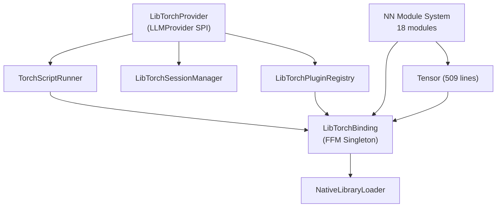

# PyTorch LibTorch Java (Quarkus) Bindings using JDK 25 FFM API

Complete Java bindings for PyTorch/LibTorch C++ frontend using JDK 25's Foreign Function & Memory (FFM) API. This project provides a high-level, idiomatic Java API that mirrors the PyTorch C++ frontend design.

## Features

✅ **Complete Tensor Operations** - Creation, manipulation, arithmetic, and mathematical operations  
✅ **Automatic Differentiation** - Full autograd support with `backward()` and gradient computation  
✅ **Neural Network Modules** - Linear, Conv2d, BatchNorm2d, Dropout, Sequential containers  
✅ **Optimizers** - SGD (with momentum), Adam, and extensible base class  
✅ **Loss Functions** - MSE, Cross Entropy, NLL Loss  
✅ **Device Management** - CPU/CUDA support with automatic device detection  
✅ **Memory Safety** - Automatic resource management with `AutoCloseable`  
✅ **Zero-Copy Interop** - Direct memory access via FFM for maximum performance  

## Architecture
# LibTorch Module — Complete Implementation

## Architecture



## File Inventory (38 source files + 2 SPI registrations)

### Provider Integration (root package)
| File | Purpose |
|------|---------|
| [LibTorchProvider](extension/format/libtorch/gollek-ext-format-libtorch/src/main/java/tech/kayys/gollek/inference/libtorch/LibTorchProvider.java) | Full `LLMProvider` SPI implementation |
| [LibTorchProviderConfig](extension/format/libtorch/gollek-ext-format-libtorch/src/main/java/tech/kayys/gollek/inference/libtorch/LibTorchProviderConfig.java) | Quarkus `@ConfigMapping` |
| [LibTorchSessionManager](extension/format/libtorch/gollek-ext-format-libtorch/src/main/java/tech/kayys/gollek/inference/libtorch/LibTorchSessionManager.java) | Per-tenant/model session pooling |
| [TorchScriptRunner](extension/format/libtorch/gollek-ext-format-libtorch/src/main/java/tech/kayys/gollek/inference/libtorch/TorchScriptRunner.java) | JIT model loading + forward pass |
| [LibTorchBeanProducer](extension/format/libtorch/gollek-ext-format-libtorch/src/main/java/tech/kayys/gollek/inference/libtorch/LibTorchBeanProducer.java) | CDI bean producer |

---

### FFM Binding Layer (`binding/`)
| File | Purpose |
|------|---------|
| [NativeLibraryLoader](extension/format/libtorch/gollek-ext-format-libtorch/src/main/java/tech/kayys/gollek/inference/libtorch/binding/NativeLibraryLoader.java) | Platform-aware native lib loading (vendor path first) |
| [LibTorchBinding](extension/format/libtorch/gollek-ext-format-libtorch/src/main/java/tech/kayys/gollek/inference/libtorch/binding/LibTorchBinding.java) | FFM singleton with 40+ symbol descriptors |

---

### Core Types (`core/`)
| File | Purpose |
|------|---------|
| [Tensor](extension/format/libtorch/gollek-ext-format-libtorch/src/main/java/tech/kayys/gollek/inference/libtorch/core/Tensor.java) | 509-line tensor wrapper with fluent API |
| [ScalarType](extension/format/libtorch/gollek-ext-format-libtorch/src/main/java/tech/kayys/gollek/inference/libtorch/core/ScalarType.java) | PyTorch dtype enum |
| [Device](extension/format/libtorch/gollek-ext-format-libtorch/src/main/java/tech/kayys/gollek/inference/libtorch/core/Device.java) | CPU/CUDA/MPS device abstraction |

---

### NN Module System (`nn/` — 18 files)

| Category | Modules |
|----------|---------|
| **Base** | [Module](extension/format/libtorch/gollek-ext-format-libtorch/src/main/java/tech/kayys/gollek/inference/libtorch/nn/Module.java), [Sequential](extension/format/libtorch/gollek-ext-format-libtorch/src/main/java/tech/kayys/gollek/inference/libtorch/nn/Sequential.java) |
| **Layers** | [Linear](extension/format/libtorch/gollek-ext-format-libtorch/src/main/java/tech/kayys/gollek/inference/libtorch/nn/Linear.java), [Conv2d](extension/format/libtorch/gollek-ext-format-libtorch/src/main/java/tech/kayys/gollek/inference/libtorch/nn/Conv2d.java), [Embedding](extension/format/libtorch/gollek-ext-format-libtorch/src/main/java/tech/kayys/gollek/inference/libtorch/nn/Embedding.java), [Flatten](extension/format/libtorch/gollek-ext-format-libtorch/src/main/java/tech/kayys/gollek/inference/libtorch/nn/Flatten.java) |
| **Activations** | [ReLU](extension/format/libtorch/gollek-ext-format-libtorch/src/main/java/tech/kayys/gollek/inference/libtorch/nn/ReLU.java), [GELU](extension/format/libtorch/gollek-ext-format-libtorch/src/main/java/tech/kayys/gollek/inference/libtorch/nn/GELU.java), [Sigmoid](extension/format/libtorch/gollek-ext-format-libtorch/src/main/java/tech/kayys/gollek/inference/libtorch/nn/Sigmoid.java), [Tanh](extension/format/libtorch/gollek-ext-format-libtorch/src/main/java/tech/kayys/gollek/inference/libtorch/nn/Tanh.java), [Softmax](extension/format/libtorch/gollek-ext-format-libtorch/src/main/java/tech/kayys/gollek/inference/libtorch/nn/Softmax.java) |
| **Normalization** | [BatchNorm2d](extension/format/libtorch/gollek-ext-format-libtorch/src/main/java/tech/kayys/gollek/inference/libtorch/nn/BatchNorm2d.java), [LayerNorm](extension/format/libtorch/gollek-ext-format-libtorch/src/main/java/tech/kayys/gollek/inference/libtorch/nn/LayerNorm.java) |
| **Regularization** | [Dropout](extension/format/libtorch/gollek-ext-format-libtorch/src/main/java/tech/kayys/gollek/inference/libtorch/nn/Dropout.java) |
| **Pooling** | [MaxPool2d](extension/format/libtorch/gollek-ext-format-libtorch/src/main/java/tech/kayys/gollek/inference/libtorch/nn/MaxPool2d.java), [AdaptiveAvgPool2d](extension/format/libtorch/gollek-ext-format-libtorch/src/main/java/tech/kayys/gollek/inference/libtorch/nn/AdaptiveAvgPool2d.java) |
| **Functional** | [Functional](extension/format/libtorch/gollek-ext-format-libtorch/src/main/java/tech/kayys/gollek/inference/libtorch/nn/Functional.java) — relu, gelu, sigmoid, tanh, softmax, logSoftmax, dropout, conv2d, batchNorm, layerNorm, maxPool2d, adaptiveAvgPool2d |
| **Loss** | [Loss](extension/format/libtorch/gollek-ext-format-libtorch/src/main/java/tech/kayys/gollek/inference/libtorch/nn/Loss.java) — mseLoss, crossEntropy, l1Loss, binaryCrossEntropy, smoothL1Loss |

---

### Optimizers (`optim/`)
| File | Purpose |
|------|---------|
| [Optimizer](extension/format/libtorch/gollek-ext-format-libtorch/src/main/java/tech/kayys/gollek/inference/libtorch/optim/Optimizer.java), [SGD](extension/format/libtorch/gollek-ext-format-libtorch/src/main/java/tech/kayys/gollek/inference/libtorch/optim/SGD.java), [Adam](extension/format/libtorch/gollek-ext-format-libtorch/src/main/java/tech/kayys/gollek/inference/libtorch/optim/Adam.java) | FFM-backed optimizers with momentum/AMSGrad |

---

### Plugin SPI (`plugin/`)
| File | Purpose |
|------|---------|
| [LibTorchPlugin](extension/format/libtorch/gollek-ext-format-libtorch/src/main/java/tech/kayys/gollek/inference/libtorch/plugin/LibTorchPlugin.java) | SPI interface |
| [LibTorchPluginRegistry](extension/format/libtorch/gollek-ext-format-libtorch/src/main/java/tech/kayys/gollek/inference/libtorch/plugin/LibTorchPluginRegistry.java) | ServiceLoader discovery + operation index |
| [CoreOpsPlugin](extension/format/libtorch/gollek-ext-format-libtorch/src/main/java/tech/kayys/gollek/inference/libtorch/plugin/builtin/CoreOpsPlugin.java), [NNOpsPlugin](extension/format/libtorch/gollek-ext-format-libtorch/src/main/java/tech/kayys/gollek/inference/libtorch/plugin/builtin/NNOpsPlugin.java), [SerializationPlugin](extension/format/libtorch/gollek-ext-format-libtorch/src/main/java/tech/kayys/gollek/inference/libtorch/plugin/builtin/SerializationPlugin.java), [CudaPlugin](extension/format/libtorch/gollek-ext-format-libtorch/src/main/java/tech/kayys/gollek/inference/libtorch/plugin/builtin/CudaPlugin.java) | Built-in plugins |

---

### SPI Service Registrations (`META-INF/services/`)
- `tech.kayys.gollek.inference.libtorch.plugin.LibTorchPlugin` — 4 built-in plugins
- `tech.kayys.gollek.spi.provider.LLMProvider` — `LibTorchProvider`

### Config
- [application.properties](extension/format/libtorch/gollek-ext-format-libtorch/src/main/resources/application.properties) — disabled by default, all settings documented

## UI / CLI Integration

### Gollek CLI
- Added dependency `gollek-ext-format-libtorch` to `gollek-cli/pom.xml`.
- Enabled provider by default in `gollek-cli/src/main/resources/application.properties`.
- Configured default model path to `~/.gollek/models/torchscript`.

---

## Requirements

- **JDK 25** or later (for FFM API)
- **LibTorch** 2.0+ (CPU or CUDA version)
- **CMake** 3.18+
- **Maven** 3.8+
- **C++ Compiler** with C++17 support (GCC 7+, Clang 5+, MSVC 2019+)

## Installation

### 1. Download LibTorch

```bash
# CPU version
wget https://download.pytorch.org/libtorch/cpu/libtorch-cxx11-abi-shared-with-deps-latest.zip
unzip libtorch-cxx11-abi-shared-with-deps-latest.zip

# CUDA version (example for CUDA 11.8)
wget https://download.pytorch.org/libtorch/cu118/libtorch-cxx11-abi-shared-with-deps-latest.zip
unzip libtorch-cxx11-abi-shared-with-deps-latest.zip

export LIBTORCH_PATH=$(pwd)/libtorch
```

### 2. Build Native Library

```bash
mkdir build && cd build
cmake -DCMAKE_PREFIX_PATH=$LIBTORCH_PATH ..
make -j$(nproc)
sudo make install  # Optional: install to system
cd ..
```

The compiled library will be copied to `src/main/resources/native/`.

### 3. Build Java Project

```bash
mvn clean package
```


### 3. Set Library Path

```bash
export LD_LIBRARY_PATH=$LIBTORCH_PATH/lib:$PWD/build/lib:$LD_LIBRARY_PATH
```

When you run the application, you may encounter a permission error. To resolve this, run the following command:
```bash
xattr -dr com.apple.quarantine <YOUR-LIBTORCH-PATH>/libtorch/libtorch-macos/lib
```

### 4. Run Example

```bash
# Set library path
export LD_LIBRARY_PATH=$LIBTORCH_PATH/lib:$PWD/build/lib:$LD_LIBRARY_PATH

# Run with JDK 25 FFM options
java --enable-preview \
     --add-modules=jdk.incubator.foreign \
     -cp target/pytorch-quarkus-binding-1.0.0-SNAPSHOT.jar \
     io.quarkus.pytorch.examples.MNISTNet
```

### 5. Run Quarkus Application

```bash
mvn quarkus:dev
```

## Usage Examples

### Basic Tensor Operations

```java
import io.quarkus.pytorch.core.Tensor;

// Create tensors
try (Tensor a = Tensor.rand(new long[]{3, 3}, Tensor.ScalarType.FLOAT);
     Tensor b = Tensor.ones(new long[]{3, 3}, Tensor.ScalarType.FLOAT)) {
    
    // Operations
    Tensor c = a.add(b);
    Tensor d = a.matmul(b);
    Tensor e = a.relu();
    
    // Print shape
    System.out.println(Arrays.toString(c.shape()));  // [3, 3]
    
    c.close();
    d.close();
    e.close();
}
```

### Automatic Differentiation

```java
// Create tensor with gradient tracking
try (Tensor x = Tensor.randn(new long[]{5, 3}, Tensor.ScalarType.FLOAT)) {
    x.requiresGrad(true);
    
    // Forward pass
    Tensor y = x.mul(x).sum();
    
    // Backward pass
    y.backward();
    
    // Get gradients
    Tensor grad = x.grad();
    System.out.println("Gradient: " + grad);
    
    grad.close();
    y.close();
}
```

### Neural Network Definition

```java
import io.quarkus.pytorch.nn.*;

public class MyNet extends Module {
    private Linear fc1, fc2, fc3;
    
    public MyNet() {
        fc1 = registerModule("fc1", new Linear(784, 128));
        fc2 = registerModule("fc2", new Linear(128, 64));
        fc3 = registerModule("fc3", new Linear(64, 10));
    }
    
    @Override
    public Tensor forward(Tensor input) {
        Tensor x = fc1.forward(input).relu();
        x = fc2.forward(x).relu();
        return fc3.forward(x);
    }
}
```

### Training Loop

```java
import io.quarkus.pytorch.optim.SGD;

MyNet model = new MyNet();
model.train();

SGD optimizer = new SGD(model.parameters(), 0.01, 0.9);

for (int epoch = 0; epoch < 10; epoch++) {
    try (Tensor input = loadBatch();
         Tensor target = loadTargets()) {
        
        // Forward
        Tensor output = model.forward(input);
        Tensor loss = computeLoss(output, target);
        
        // Backward
        optimizer.zeroGrad();
        loss.backward();
        optimizer.step();
        
        System.out.printf("Epoch %d, Loss: %.4f%n", epoch, lossValue(loss));
        
        output.close();
        loss.close();
    }
}

model.close();
```

### GPU Support

```java
// Check CUDA availability
if (Tensor.cudaIsAvailable()) {
    System.out.println("CUDA is available!");
    
    // Move tensor to GPU
    try (Tensor cpuTensor = Tensor.rand(new long[]{100, 100}, Tensor.ScalarType.FLOAT);
         Tensor gpuTensor = cpuTensor.to(Tensor.Device.CUDA)) {
        
        // Computations on GPU
        Tensor result = gpuTensor.matmul(gpuTensor);
        
        // Move back to CPU
        Tensor cpuResult = result.to(Tensor.Device.CPU);
        
        result.close();
        cpuResult.close();
    }
}
```

### Sequential Model Builder

```java
import io.quarkus.pytorch.nn.Sequential;

Module model = new Sequential()
    .add("fc1", new Linear(784, 256))
    .add("relu1", new ReLUModule())
    .add("dropout1", new Dropout(0.5))
    .add("fc2", new Linear(256, 10));

try (Tensor input = Tensor.randn(new long[]{32, 784}, Tensor.ScalarType.FLOAT)) {
    Tensor output = model.forward(input);
    output.close();
}

model.close();
```

## API Reference

### Core Classes

#### `Tensor`
- `zeros(shape, dtype)` - Create zero tensor
- `ones(shape, dtype)` - Create ones tensor
- `rand(shape, dtype)` - Random uniform [0, 1)
- `randn(shape, dtype)` - Random normal N(0, 1)
- `add(other)` - Element-wise addition
- `mul(other)` - Element-wise multiplication
- `matmul(other)` - Matrix multiplication
- `relu()` - ReLU activation
- `sigmoid()` - Sigmoid activation
- `softmax(dim)` - Softmax along dimension
- `backward()` - Compute gradients
- `grad()` - Get gradient tensor
- `to(device)` - Move to device

#### `Module`
- `forward(input)` - Forward pass (abstract)
- `parameters()` - Get all parameters
- `train()` / `eval()` - Set mode
- `to(device)` - Move to device
- `zeroGrad()` - Zero gradients

#### `Linear`
- `Linear(inFeatures, outFeatures)` - Fully connected layer

#### `SGD`
- `SGD(params, lr, momentum)` - Stochastic gradient descent
- `step()` - Update parameters
- `zeroGrad()` - Zero gradients

#### `Adam`
- `Adam(params, lr)` - Adam optimizer
- `step()` - Update parameters

## Performance Considerations

### Memory Management
- Always use try-with-resources for `Tensor` and `Module`
- Close tensors explicitly when not using try-with-resources
- Use `Arena.ofConfined()` for scoped memory management

### Zero-Copy Operations
- FFM provides direct memory access without copying
- Use `dataPtr()` for raw pointer access
- Efficient interop with native libraries

### GPU Best Practices
- Batch operations for better GPU utilization
- Keep data on GPU between operations
- Use appropriate batch sizes (32, 64, 128, 256)

## Project Structure

```
pytorch-quarkus-binding/
├── pom.xml                          # Maven configuration
├── CMakeLists.txt                   # Native build configuration
├── README.md
├── src/
│   ├── main/
│   │   ├── cpp/
│   │   │   └── libtorch_wrapper.cpp # C wrapper for LibTorch
│   │   ├── java/io/quarkus/pytorch/
│   │   │   ├── binding/
│   │   │   │   └── LibTorchFFM.java # FFM bindings
│   │   │   ├── core/
│   │   │   │   └── Tensor.java       # High-level tensor API
│   │   │   ├── nn/
│   │   │   │   ├── Module.java       # Base module class
│   │   │   │   ├── Linear.java       # Linear layer
│   │   │   │   ├── Conv2d.java       # Convolutional layer
│   │   │   │   ├── Sequential.java   # Sequential container
│   │   │   │   └── ...
│   │   │   ├── optim/
│   │   │   │   ├── Optimizer.java    # Base optimizer
│   │   │   │   ├── SGD.java          # SGD optimizer
│   │   │   │   └── Adam.java         # Adam optimizer
│   │   │   └── examples/
│   │   │       └── MNISTNet.java     # Example neural network
│   │   └── resources/
│   │       └── application.properties
│   └── test/
│       └── java/
└── build/                           # Build output
```

## Troubleshooting

### Library Not Found
```bash
# Add to LD_LIBRARY_PATH
export LD_LIBRARY_PATH=/path/to/libtorch/lib:$LD_LIBRARY_PATH
```

### Symbol Not Found
Ensure LibTorch ABI matches your system:
- Use `cxx11-abi` for modern systems
- Use `pre-cxx11-abi` for older systems

### CUDA Issues
```bash
# Check CUDA version
nvcc --version

# Download matching LibTorch version
# https://pytorch.org/get-started/locally/
```

### FFM API Issues
Ensure JDK 25+ is installed:
```bash
java --version
# Should show 25 or later
```

## License

This project demonstrates FFM API usage with LibTorch. Refer to PyTorch license for LibTorch usage.

## Contributing

Contributions welcome! Areas for improvement:
- Additional neural network layers
- More optimizer implementations
- Data loading utilities
- Serialization support
- Extended loss functions

## References

- [PyTorch C++ Frontend Documentation](https://pytorch.org/cppdocs/frontend.html)
- [JDK 25 FFM API](https://openjdk.org/jeps/454)
- [LibTorch Installation](https://pytorch.org/cppdocs/installing.html)
- [Quarkus Documentation](https://quarkus.io/)
