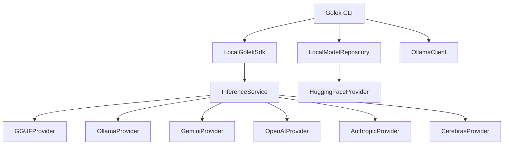

# Production-Ready Golek CLI

Production-ready CLI similar to Ollama CLI, integrating with existing providers and model repository.

## Goal

Create a fully functional CLI that supports:
- **Local inference** via GGUF adapter (llama.cpp)
- **Ollama integration** for local models with external engine
- **Cloud providers** (Gemini, etc.)
- **Model management** (pull, list, show, delete)

## Architecture Overview



## Supported Providers

| Provider | Description | API Key Required |
|----------|-------------|------------------|
| `gguf` | Local GGUF models via llama.cpp | No |
| `ollama` | Ollama local server | No |
| `gemini` | Google Gemini | Yes |
| `openai` | OpenAI GPT models | Yes |
| `anthropic` | Claude models | Yes |
| `cerebras` | Cerebras Inference | Yes |

## Commands

| Command | Description | Provider/Module |
|---------|-------------|-----------------|
| `golek run` | Run inference with a model | All providers |
| `golek pull` | Download model from registry | HuggingFace, Ollama |
| `golek list` | List local models | LocalModelRepository |
| `golek show` | Show model details | LocalModelRepository, Ollama |
| `golek serve` | Start API server | All providers |
| `golek providers` | List available providers | ProviderRegistry |
| `golek chat` | Interactive chat session | All providers |

---


Production-ready CLI inspired by Ollama CLI with full provider support.

## Supported Providers

| Provider | Description | API Key |
|----------|-------------|---------|
| `gguf` | Local GGUF via llama.cpp | No |
| `ollama` | Ollama server | No |
| `gemini` | Google Gemini | Yes |
| `openai` | OpenAI GPT | Yes |
| `anthropic` | Claude | Yes |
| `cerebras` | Cerebras | Yes |

## Commands

| Command | Description |
|---------|-------------|
| `run` | Run inference |
| `chat` | Interactive chat |
| `pull` | Download models |
| `list` | List local models |
| `show` | Model details |
| `providers` | List providers |

## Usage Examples

```bash
# Build
cd inference-golek && mvn clean package -pl ui/golek-cli -am

# List providers
java -jar ui/golek-cli/target/quarkus-app/quarkus-run.jar providers

# Run with different providers
java -jar ui/golek-cli/target/quarkus-app/quarkus-run.jar run \
  --provider openai --model gpt-4 --prompt "Hello"

java -jar ui/golek-cli/target/quarkus-app/quarkus-run.jar run \
  --provider anthropic --model claude-3-opus --prompt "Hello"

java -jar ui/golek-cli/target/quarkus-app/quarkus-run.jar run \
  --provider cerebras --model llama-3.1-8b --prompt "Hello"
```


## Proposed Changes

### Build Configuration

#### [MODIFY] [pom.xml](file:///Users/bhangun/Workspace/workkayys/Products/Wayang/wayang-platform/inference-golek/ui/golek-cli/pom.xml)
Add dependencies for all providers and model repository:
- `golek-sdk-java-local` - Local SDK
- `golek-model-repo-core` - Model repository
- `golek-provider-ollama` - Ollama provider
- `golek-provider-gemini` - Gemini provider
- `golek-provider-huggingface` - HuggingFace for model downloads
- `golek-adapter-gguf` - Local GGUF inference

---

### CLI Commands

#### [MODIFY] [GolekCommand.java](file:///Users/bhangun/Workspace/workkayys/Products/Wayang/wayang-platform/inference-golek/ui/golek-cli/src/main/java/tech/kayys/golek/cli/GolekCommand.java)
Update to include all subcommands.

#### [MODIFY] [RunCommand.java](file:///Users/bhangun/Workspace/workkayys/Products/Wayang/wayang-platform/inference-golek/ui/golek-cli/src/main/java/tech/kayys/golek/cli/commands/RunCommand.java)
Enhanced run command with:
- `--provider` option to select provider (gguf, ollama, gemini)
- `--stream` flag for streaming output
- `--temperature`, `--max-tokens` options

#### [NEW] [PullCommand.java](file:///Users/bhangun/Workspace/workkayys/Products/Wayang/wayang-platform/inference-golek/ui/golek-cli/src/main/java/tech/kayys/golek/cli/commands/PullCommand.java)
```java
@Command(name = "pull", description = "Pull a model from registry")
```
- Support HuggingFace: `golek pull hf:TheBloke/Llama-2-7B-GGUF`
- Support Ollama: `golek pull ollama:llama2`
- Progress bar display

#### [NEW] [ListCommand.java](file:///Users/bhangun/Workspace/workkayys/Products/Wayang/wayang-platform/inference-golek/ui/golek-cli/src/main/java/tech/kayys/golek/cli/commands/ListCommand.java)
```java
@Command(name = "list", aliases = "ls", description = "List local models")
```
- Display: NAME, SIZE, FORMAT, MODIFIED

#### [NEW] [ShowCommand.java](file:///Users/bhangun/Workspace/workkayys/Products/Wayang/wayang-platform/inference-golek/ui/golek-cli/src/main/java/tech/kayys/golek/cli/commands/ShowCommand.java)
Show model details (parameters, license, architecture).

#### [NEW] [ProvidersCommand.java](file:///Users/bhangun/Workspace/workkayys/Products/Wayang/wayang-platform/inference-golek/ui/golek-cli/src/main/java/tech/kayys/golek/cli/commands/ProvidersCommand.java)
List available providers with status (healthy/unhealthy).

#### [NEW] [ChatCommand.java](file:///Users/bhangun/Workspace/workkayys/Products/Wayang/wayang-platform/inference-golek/ui/golek-cli/src/main/java/tech/kayys/golek/cli/commands/ChatCommand.java)
Interactive chat mode with conversation history.

#### [NEW] [ServeCommand.java](file:///Users/bhangun/Workspace/workkayys/Products/Wayang/wayang-platform/inference-golek/ui/golek-cli/src/main/java/tech/kayys/golek/cli/commands/ServeCommand.java)
Start local API server (OpenAI-compatible).

---

### Supporting Classes

#### [NEW] [ProgressBar.java](file:///Users/bhangun/Workspace/workkayys/Products/Wayang/wayang-platform/inference-golek/ui/golek-cli/src/main/java/tech/kayys/golek/cli/util/ProgressBar.java)
Console progress bar for downloads.

#### [NEW] [OutputFormatter.java](file:///Users/bhangun/Workspace/workkayys/Products/Wayang/wayang-platform/inference-golek/ui/golek-cli/src/main/java/tech/kayys/golek/cli/util/OutputFormatter.java)
Format output as table, JSON, or plain text.

#### [NEW] [ProviderResolver.java](file:///Users/bhangun/Workspace/workkayys/Products/Wayang/wayang-platform/inference-golek/ui/golek-cli/src/main/java/tech/kayys/golek/cli/service/ProviderResolver.java)
Resolve model name to appropriate provider.

---

## Implementation Priority

1. **Phase 1** - Core Commands
   - `run` with provider selection
   - `list` local models
   - `show` model info
   - `providers` list

2. **Phase 2** - Model Management
   - `pull` from HuggingFace/Ollama
   - Progress bar

3. **Phase 3** - Advanced Features
   - `chat` interactive mode
   - `serve` API server

---

## Verification Plan

### Build & Test
```bash
cd inference-golek
mvn clean package -pl ui/golek-cli -am
mvn test -pl ui/golek-cli
```

### Manual Testing
```bash
# List providers
java -jar ui/golek-cli/target/quarkus-app/quarkus-run.jar providers

# List local models
java -jar ui/golek-cli/target/quarkus-app/quarkus-run.jar list

# Run with Ollama
java -jar ui/golek-cli/target/quarkus-app/quarkus-run.jar run \
  --provider ollama --model llama2 --prompt "Hello"

# Run with GGUF
java -jar ui/golek-cli/target/quarkus-app/quarkus-run.jar run \
  --provider gguf --model /path/to/model.gguf --prompt "Hello"

# Pull model from Ollama
java -jar ui/golek-cli/target/quarkus-app/quarkus-run.jar pull ollama:llama2
```
