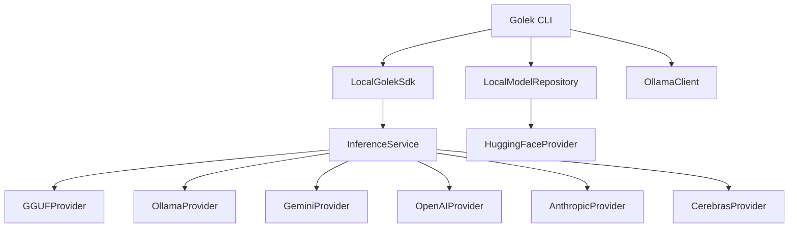

# Production-Ready Golek CLI

Production-ready CLI similar to Ollama CLI, integrating with existing providers and model repository.


```bash
  _____       _      _    
 / ____|     | |    | |   
| |  __  ___ | | ___| | __
| | |_ |/ _ \| |/ _ \ |/ /
| |__| | (_) | |  __/   < 
 \_____|\___/|_|\___|_|\_\

Model: qwen2.5-7b-instruct-GGUF
Provider: gguf
Commands: 'exit' to quit, '/reset' to clear history.
Note: Use '\' at the end of a line for multiline input.
--------------------------------------------------

>>> Hello, what can you do?

Assistant: I can help you with coding, writing, and analysis...

[Tokens: 42, Duration: 0.85s, Speed: 49.41 t/s]

```

## Build

```bash
cd inference-golek && mvn clean package -pl ui/golek-cli -am
```

## Build Native
```bash
cd inference-golek && mvn clean package -pl ui/golek-cli -am -Pnative -DskipTests
```

Other options to build native:

Option 1: Disable UPX compression (quickest solution) Add this property to skip the compression step:

```bash
mvn clean package -pl ui/golek-cli -am -Pnative -DskipTests -Dquarkus.native.compression.disable=true
```
Option 2: Install UPX (for smaller executable) If you want the compressed executable, install UPX manually:

```bash
brew install upx
mvn clean package -pl ui/golek-cli -am -Pnative -DskipTests
```

> **Note**: The GGUF provider uses Panama FFM (Foreign Function & Memory API) to interface with llama.cpp. GraalVM native image requires explicit registration of foreign function calls via `reachability-metadata.json` in the `golek-ext-format-gguf` module.

## Goal

Create a fully functional CLI that supports:
- **Local inference** via GGUF adapter (llama.cpp)
- **Ollama integration** for local models with external engine
- **Cloud providers** (Gemini, etc.)
- **Model management** (pull, list, show, delete)

## Architecture Overview



## Supported Providers

| Provider | Description | API Key Required |
|----------|-------------|------------------|
| `litert` | Local LiteRT (TFLite) models | No |
| `gguf` | Local GGUF models via llama.cpp | No |
| `ollama` | Ollama local server | No |
| `gemini` | Google Gemini | Yes |
| `openai` | OpenAI GPT models | Yes |
| `anthropic` | Claude models | Yes |
| `cerebras` | Cerebras Inference | Yes |

## Commands

| Command | Description | Provider/Module |
|---------|-------------|-----------------|
| `golek run` | Run inference with a model | All providers |
| `golek pull` | Download model from registry | HuggingFace, Ollama |
| `golek list` | List local models | LocalModelRepository |
| `golek show` | Show model details | LocalModelRepository, Ollama |
| `golek serve` | Start API server | All providers |
| `golek providers` | List available providers | ProviderRegistry |
| `golek chat` | Interactive chat session | All providers |

---


Production-ready CLI inspired by Ollama CLI with full provider support.

## Supported Providers

| Provider | Description | API Key |
|----------|-------------|---------|
| `litert` | Local LiteRT (TFLite) | No |
| `gguf` | Local GGUF via llama.cpp | No |
| `ollama` | Ollama server | No |
| `gemini` | Google Gemini | Yes |
| `openai` | OpenAI GPT | Yes |
| `anthropic` | Claude | Yes |
| `cerebras` | Cerebras | Yes |

## Commands

| Command | Description |
|---------|-------------|
| `run` | Run inference |
| `chat` | Interactive chat |
| `pull` | Download models |
| `list` | List local models |
| `show` | Model details |
| `providers` | List providers |


## Usage Examples

```bash
# Build
cd inference-golek && mvn clean package -pl ui/golek-cli -am

# List providers
java -jar ui/golek-cli/target/quarkus-app/quarkus-run.jar providers

java -jar target/golek-cli-1.0.0-SNAPSHOT-runner.jar run --provider gguf --model Qwen/Qwen2.5-0.5B-Instruct --prompt "Hello"

java -jar ui/golek-cli/target/golek-cli-1.0.0-SNAPSHOT-runner.jar run --provider gguf --model Qwen/Qwen2.5-0.5B-Instruct --prompt "Explain quantum entanglement in 2 sentences."


java -jar ui/golek-cli/target/golek-cli-1.0.0-SNAPSHOT-runner.jar chat --provider gguf --model Qwen/Qwen2.5-0.5B-Instruct 

# Minimal output mode (recommended for native GGUF)
java -jar ui/golek-cli/target/golek-cli-1.0.0-SNAPSHOT-runner.jar chat --provider gguf --model Qwen/Qwen2.5-0.5B-Instruct --quiet

java -jar ui/golek-cli/target/golek-cli-1.0.0-SNAPSHOT-runner.jar chat --provider gguf --model Qwen/Qwen2.5-0.5B-Instruct 


java -jar ui/golek-cli/target/golek-cli-1.0.0-SNAPSHOT-runner.jar chat --model google-t5/t5-small

HuggingFaceTB/SmolLM2-135M
meta-llama/Llama-3.2-1B
google/gemma-2b-it

# Run with different providers
java -jar ui/golek-cli/target/quarkus-app/quarkus-run.jar run \
  --provider openai --model gpt-4 --prompt "Hello"

java -jar ui/golek-cli/target/quarkus-app/quarkus-run.jar run \
  --provider anthropic --model claude-3-opus --prompt "Hello"

java -jar ui/golek-cli/target/quarkus-app/quarkus-run.jar run \
  --provider cerebras --model llama-3.1-8b --prompt "Hello"
```


### Run native
```bash
./target/golek-cli-1.0.0-SNAPSHOT-runner chat --provider gguf --model Qwen/Qwen2.5-0.5B-Instruct  
```

### Native smoke check
```bash
./scripts/native-gguf-smoke.sh Qwen/Qwen2.5-0.5B-Instruct
```

If the native executable cannot find `llama.cpp` libraries, point it explicitly:

```bash
export GOLEK_LLAMA_LIB_DIR=/absolute/path/to/native-libs
# or:
export GOLEK_LLAMA_LIB_PATH=/absolute/path/to/libllama.dylib
```

To enable file logging explicitly:
```bash
export GOLEK_CLI_FILE_LOG=true
export GOLEK_CLI_LOG_FILE="$HOME/.golek/logs/cli.log"
```


```bash
# First run - downloads
$ golek run --model Qwen/Qwen2.5-0.5B-Instruct --prompt "Hi"
Checking model: Qwen/Qwen2.5-0.5B-Instruct... not found locally.
Attempting to download from Hugging Face...
Downloading: ████████████████████ 100% (468/468 MB)
✓ Model saved to: ~/.golek/models/gguf/Qwen_Qwen2.5-0.5B-Instruct-GGUF
Model path: ~/.golek/models/gguf/Qwen_Qwen2.5-0.5B-Instruct-GGUF
[inference output]

# Second run - uses existing
$ golek run --model Qwen/Qwen2.5-0.5B-Instruct --prompt "Hi"
Checking model: Qwen/Qwen2.5-0.5B-Instruct... found local variant: Qwen/Qwen2.5-0.5B-Instruct-GGUF
Model path: ~/.golek/models/gguf/Qwen_Qwen2.5-0.5B-Instruct-GGUF
[inference output]

# Using custom path
$ golek run --model-path /my/models/custom.gguf --prompt "Hi"
Using model from: /my/models/custom.gguf
[inference output]

# Ctrl+C - exits immediately
$ golek run --model Qwen/Qwen2.5-0.5B-Instruct --prompt "Hi"
Downloading: ████░░░░░░░░░░░░░░░░ 20% (94/468 MB)^C
✗ Download cancelled
```

## Build and Run
```bash
cd inference-golek
mvn clean package -pl ui/golek-cli -am -DskipTests
java -jar ui/golek-cli/target/golek-cli-*-runner.jar chat -m <model> --session

```

```bash
# Interactive chat with session (KV cache enabled)
golek chat --model Qwen/Qwen2.5-0.5B-Instruct --session

# Chat with function calling model
golek chat --model <tool-model> --session
# Then type: "What's the weather in Jakarta?"
# Output: [Tool Call] get_weather({"city": "Jakarta"})
```

## Proposed Changes

### Build Configuration

#### [MODIFY] [pom.xml](file://~/Workspace/workkayys/Products/Wayang/wayang-platform/inference-golek/ui/golek-cli/pom.xml)
Add dependencies for all providers and model repository:
- `golek-sdk-java-local` - Local SDK
- `golek-model-repo-core` - Model repository
- `golek-ext-cloud-ollama` - Ollama provider
- `golek-ext-cloud-gemini` - Gemini provider
- `golek-provider-huggingface` - HuggingFace for model downloads
- `golek-ext-format-gguf` - Local GGUF inference

---

### CLI Commands

#### [MODIFY] [GolekCommand.java](file://~/Workspace/workkayys/Products/Wayang/wayang-platform/inference-golek/ui/golek-cli/src/main/java/tech/kayys/golek/cli/GolekCommand.java)
Update to include all subcommands.

#### [MODIFY] [RunCommand.java](file://~/Workspace/workkayys/Products/Wayang/wayang-platform/inference-golek/ui/golek-cli/src/main/java/tech/kayys/golek/cli/commands/RunCommand.java)
Enhanced run command with:
- `--provider` option to select provider (litert, gguf, ollama, gemini)
- `--stream` flag for streaming output
- `--temperature`, `--max-tokens` options

#### [NEW] [PullCommand.java](file://~/Workspace/workkayys/Products/Wayang/wayang-platform/inference-golek/ui/golek-cli/src/main/java/tech/kayys/golek/cli/commands/PullCommand.java)
```java
@Command(name = "pull", description = "Pull a model from registry")
```
- Support HuggingFace: `golek pull hf:TheBloke/Llama-2-7B-GGUF`
- Support Ollama: `golek pull ollama:llama2`
- Progress bar display

#### [NEW] [ListCommand.java](file://~/Workspace/workkayys/Products/Wayang/wayang-platform/inference-golek/ui/golek-cli/src/main/java/tech/kayys/golek/cli/commands/ListCommand.java)
```java
@Command(name = "list", aliases = "ls", description = "List local models")
```
- Display: NAME, SIZE, FORMAT, MODIFIED

#### [NEW] [ShowCommand.java](file://~/Workspace/workkayys/Products/Wayang/wayang-platform/inference-golek/ui/golek-cli/src/main/java/tech/kayys/golek/cli/commands/ShowCommand.java)
Show model details (parameters, license, architecture).

#### [NEW] [ProvidersCommand.java](file://~/Workspace/workkayys/Products/Wayang/wayang-platform/inference-golek/ui/golek-cli/src/main/java/tech/kayys/golek/cli/commands/ProvidersCommand.java)
List available providers with status (healthy/unhealthy).

#### [NEW] [ChatCommand.java](file://~/Workspace/workkayys/Products/Wayang/wayang-platform/inference-golek/ui/golek-cli/src/main/java/tech/kayys/golek/cli/commands/ChatCommand.java)
Interactive chat mode with conversation history.

#### [NEW] [ServeCommand.java](file://~/Workspace/workkayys/Products/Wayang/wayang-platform/inference-golek/ui/golek-cli/src/main/java/tech/kayys/golek/cli/commands/ServeCommand.java)
Start local API server (OpenAI-compatible).

---

### Supporting Classes

#### [NEW] [ProgressBar.java](file://~/Workspace/workkayys/Products/Wayang/wayang-platform/inference-golek/ui/golek-cli/src/main/java/tech/kayys/golek/cli/util/ProgressBar.java)
Console progress bar for downloads.

#### [NEW] [OutputFormatter.java](file://~/Workspace/workkayys/Products/Wayang/wayang-platform/inference-golek/ui/golek-cli/src/main/java/tech/kayys/golek/cli/util/OutputFormatter.java)
Format output as table, JSON, or plain text.

#### [NEW] [ProviderResolver.java](file://~/Workspace/workkayys/Products/Wayang/wayang-platform/inference-golek/ui/golek-cli/src/main/java/tech/kayys/golek/cli/service/ProviderResolver.java)
Resolve model name to appropriate provider.

---

## Implementation Priority

1. **Phase 1** - Core Commands
   - `run` with provider selection
   - `list` local models
   - `show` model info
   - `providers` list

2. **Phase 2** - Model Management
   - `pull` from HuggingFace/Ollama
   - Progress bar

3. **Phase 3** - Advanced Features
   - `chat` interactive mode
   - `serve` API server

---

## Verification Plan

### Build & Test
```bash
cd inference-golek
mvn clean package -pl ui/golek-cli -am
mvn test -pl ui/golek-cli
```

### Manual Testing
```bash
# List providers
java -jar ui/golek-cli/target/quarkus-app/quarkus-run.jar providers

# List local models
java -jar ui/golek-cli/target/quarkus-app/quarkus-run.jar list

# Run with Ollama
java -jar ui/golek-cli/target/quarkus-app/quarkus-run.jar run \
  --provider ollama --model llama2 --prompt "Hello"

# Run with GGUF
java -jar ui/golek-cli/target/quarkus-app/quarkus-run.jar run \
  --provider gguf --model /path/to/model.gguf --prompt "Hello"
  --provider litert --model /path/to/model.tflite --prompt "Hello"

# Pull model from Ollama
java -jar ui/golek-cli/target/quarkus-app/quarkus-run.jar pull ollama:llama2
```
